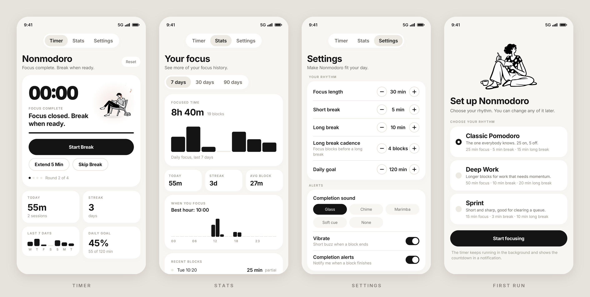

# Nonmodoro

[English](README.en.md) | **简体中文**

安静的 Android 番茄钟，没有多余功能。



## 运行要求

- Android 8.0（API 26）及以上
- 构建需要 JDK 17、Android SDK 37

## 构建

可以在 Release 下找到打包好的 APK，如果你想自己 build：

```sh
./gradlew assembleDebug      # 生成 APK → app/build/outputs/apk/debug/
./gradlew installDebug       # 安装到已连接的设备
```

## 致谢

灵感来自 Mac 应用 Kofe Flow，你可以在 App Store 找到它。字体：[Inter](https://rsms.me/inter/)。

## 许可证

[MIT](LICENSE)
